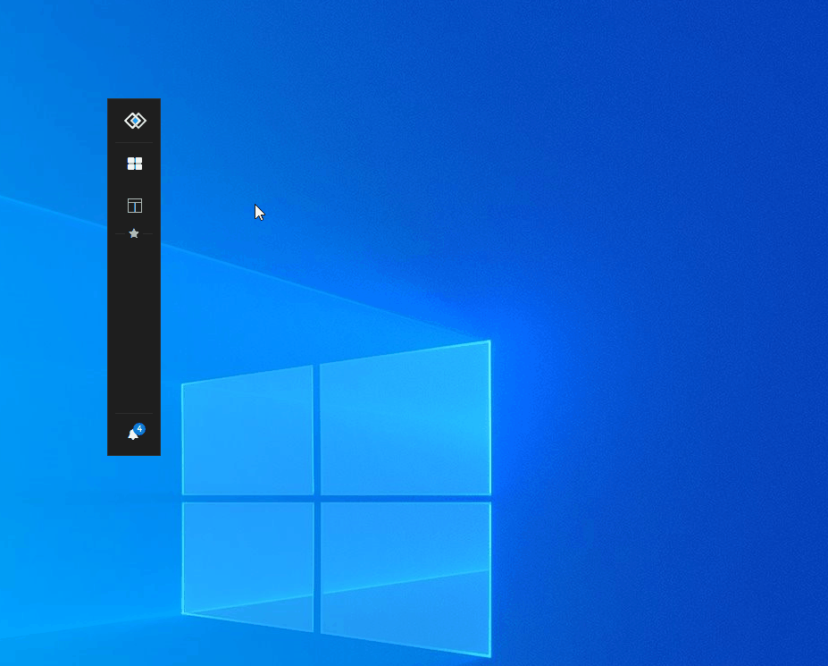

## Vanilla JS implementation of a Glue42 Toolbar

Simple vanilla.js implementation of a Glue42 Toolbar.

Prerequisites: None. The code does not need any other modules, packages or installations.

Main functionalities
- Listing, searching and starting applications
- Adding and removing applications from favorites
- Listing, searching and opening layouts (including Global, Swimlane and Workspace layouts)
- Managing basic settings of toolbar
- Changing Glue42 color theme
- Searching for clients and instruments (if available via GSS), listing and starting application that can open the search entity(client or instrument)
- Switching between horizontal and vertical versions
- Open the Glue42 Feedback Form
- Open the Glue42 Notifications Panel
